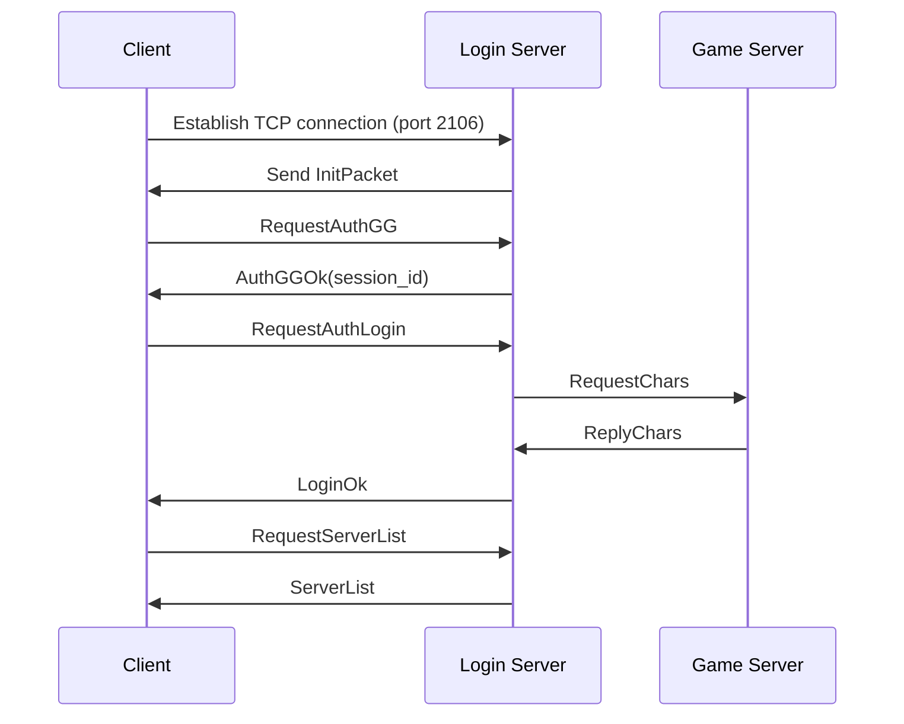
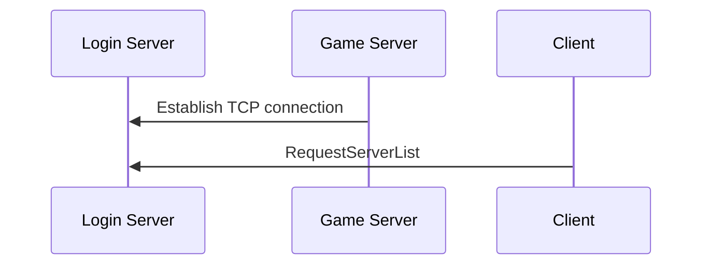

# This is a server emulator for Lineage 2 (under development)

Ready features:

- [x] Login server
- [ ] Game server

## The login process

```mermaid
sequenceDiagram
    participant Client
    participant Login Server
    participant Game Server

    Client->>Login Server: Establish TCP connection (port 2106)
    Login Server->>Client: Send InitPacket
    Client->>Login Server: RequestAuthGG
    Login Server->>Client: AuthGGOk(session_id)
    Client->>Login Server: RequestAuthLogin
    Login Server->>Game Server: RequestChars
    Game Server->>Login Server: ReplyChars
    Login Server->>Client: LoginOk
    Client->>Login Server: RequestServerList
    Login Server->>Client: ServerList

```

## Game server connection process

```mermaid
sequenceDiagram
    participant Login Server
    participant Game Server

    Game Server->>Login Server: Establish TCP connection
    Client->>Login Server: RequestServerList
```