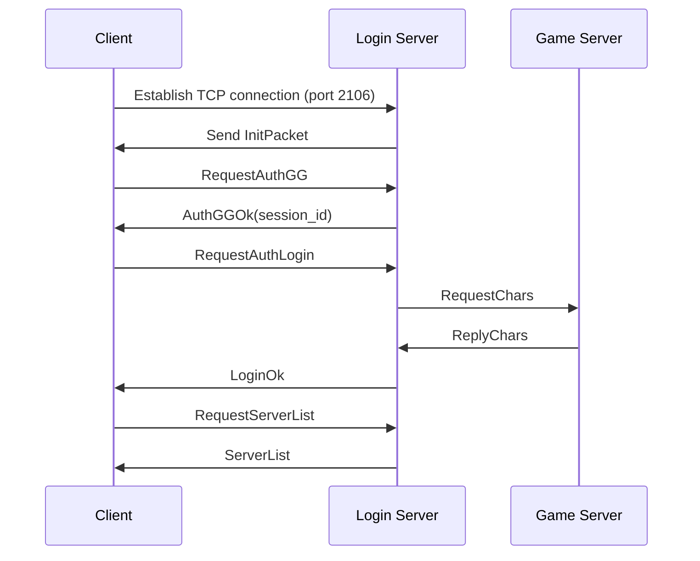
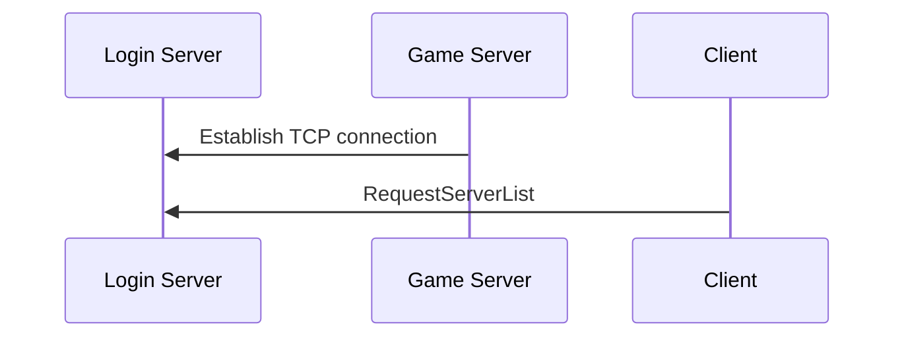

# L2Shablya ⚔️  

*Inspired by the swift, light, and deadly Kozak weapon, L2Shablya embodies precision and speed in every line of code.*

**Disclaimer**: *The name "Shablya" reflects the project's focus on performance and elegance, paying homage to the iconic Kozak weapon. It is used here metaphorically and holds no association with real-world conflict or violence.*

Current state: `Under development`

Ready features:

- [x] Login server
- [ ] Game server

## The login process

## Game server connection process

