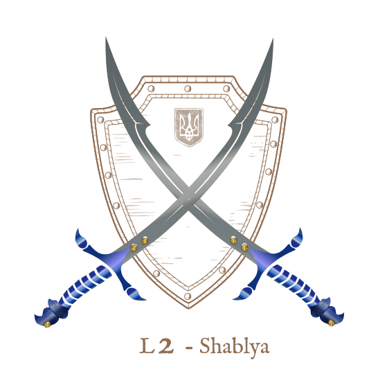

# L2Shablya ⚔️ 🇺🇦

<div align="center">
    
</div>
*Inspired by the swift, light, and deadly Kozak weapon, L2Shablya embodies precision and speed in every line of code.*

**Disclaimer**: *The name "Shablya" reflects the project's focus on performance and elegance, paying homage to the
iconic Kozak weapon. It is used here metaphorically and holds no association with real-world conflict or violence.*

Current state: `Under development`

Ready features:

- [x] Login server
- [ ] Game server

## The login process


## Game server connection process


## Local deployment

- create .env file

```bash
DATABASE_URL=sqlite://local.sqlite?mode=rwc
```

- install cargo and rust
- install sea-orm-cli

```bash
cargo install sea-orm-cli
```

- run migrations

```bash
sea-orm-cli migrate up
```

- run login server

```bahs
cargo run --bin login
```

- run game server

```bash
cargo run --bin game
```
